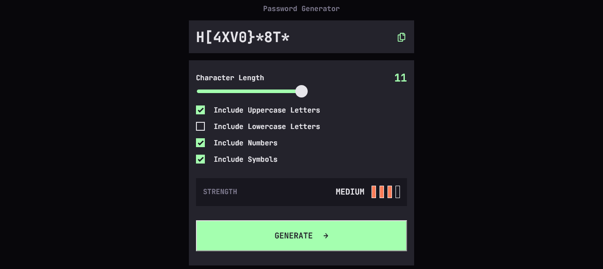

# Frontend Mentor - Password generator app solution

This is a solution to the [Password generator app challenge on Frontend Mentor](https://www.frontendmentor.io/challenges/password-generator-app-Mr8CLycqjh). Frontend Mentor challenges help you improve your coding skills by building realistic projects.

## Table of contents

- [Overview](#overview)
  - [The challenge](#the-challenge)
  - [Screenshot](#screenshot)
  - [Links](#links)
- [My process](#my-process)
  - [Built with](#built-with)
  - [What I learned](#what-i-learned)
  - [Continued development](#continued-development)
  - [Useful resources](#useful-resources)
- [Author](#author)
- [Acknowledgments](#acknowledgments)

**Note: Delete this note and update the table of contents based on what sections you keep.**

## Overview

### The challenge

Users should be able to:

- Generate a password based on the selected inclusion options
- Copy the generated password to the computer's clipboard
- See a strength rating for their generated password
- View the optimal layout for the interface depending on their device's screen size
- See hover and focus states for all interactive elements on the page

### Screenshot

### Links

- Solution URL: [Solution URL](https://github.com/engsofjvolfe/frontendmentor/tree/main/password-generator-app)
- Live Site URL: [Live site URL](https://jvolfe-fempwd-generator.netlify.app/)

## My process

### Built with

- Semantic HTML5 markup
- CSS custom properties
- Flexbox
- CSS Grid
- Mobile-first workflow
- JavaScript
- ChatGPT
- clipboard.writeText

### What I learned

- I used chat GPT for the first time so i could learn how to create iteractions using JS. I didn't know how to use the slider, checkboxes, link checkboxes with logic elements. So the tool helped me a lot, at the same time, the comments were generated and helped me to learn properly how this code works. I still need to implement a lot of new codes using these elements, so i'll be able to create muscle memory.

### Continued development

## Author

- Git Hub - [@engsofjvolfe](https://github.com/engsofjvolfe)
- Frontend Mentor - [@engsofjvolfe](https://www.frontendmentor.io/profile/engsofjvolfe)
- LinkedIn - [@jeanco-volfe](https://www.linkedin.com/in/jeanco-volfe/)
<!-- - Instagram - [@jeanco_volfe](https://www.instagram.com/jeanco_volfe/) -->
