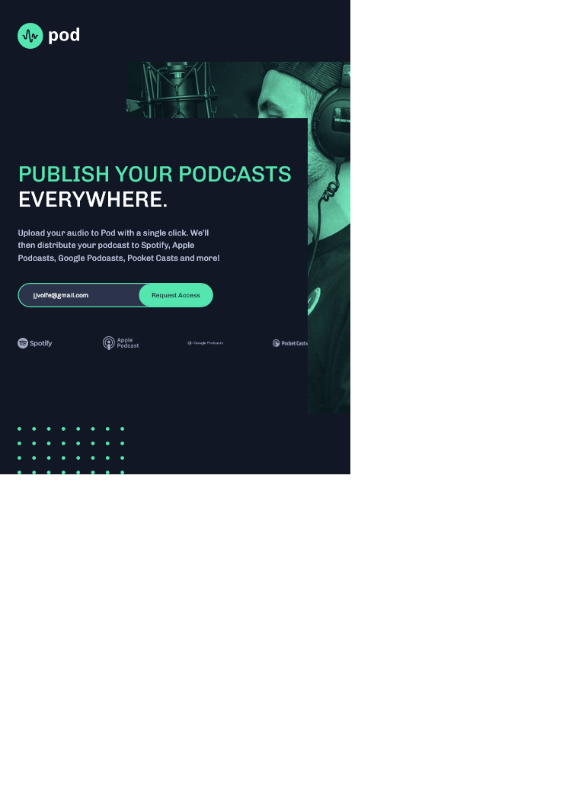
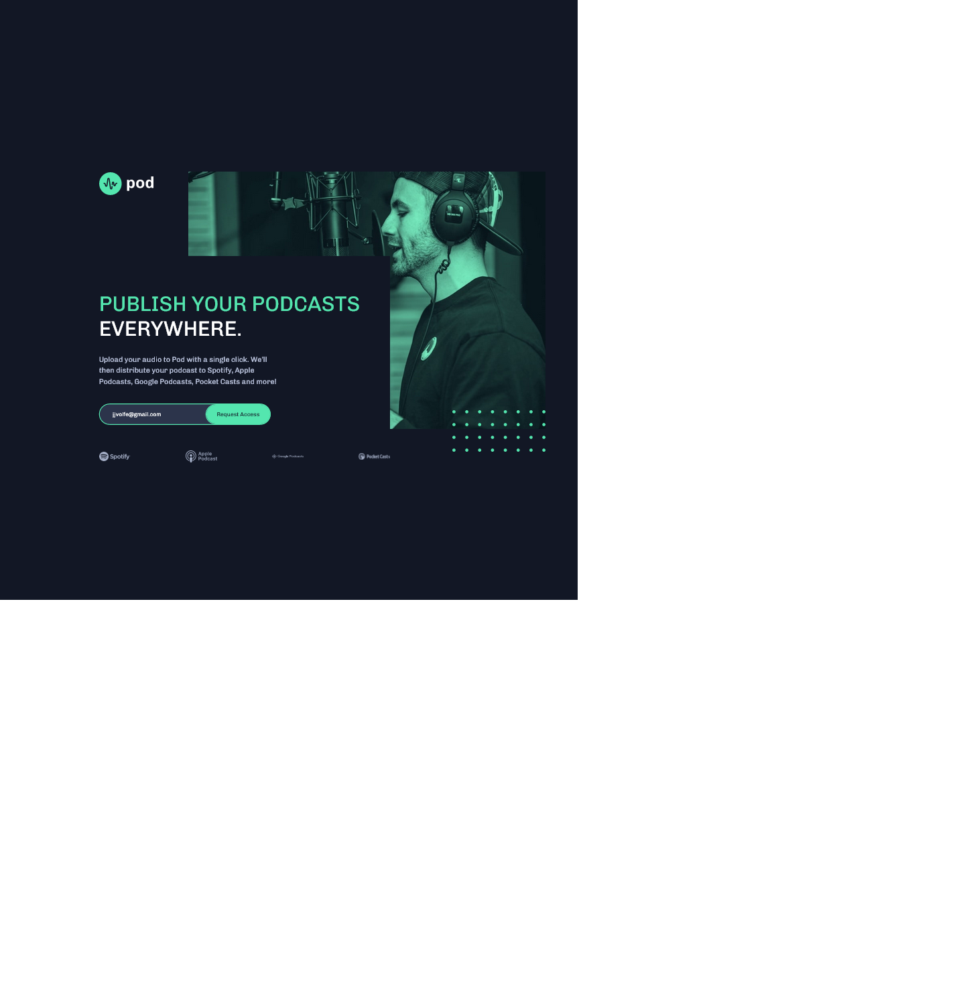

# Frontend Mentor - Pod request access landing page solution

This is a solution to the [Pod request access landing page challenge on Frontend Mentor](https://www.frontendmentor.io/challenges/pod-request-access-landing-page-eyTmdkLSG). Frontend Mentor challenges help you improve your coding skills by building realistic projects.

## Table of contents

- [Overview](#overview)
  - [The challenge](#the-challenge)
  - [Screenshot](#screenshot)
  - [Links](#links)
- [My process](#my-process)
  - [Built with](#built-with)
- [Author](#author)

### The challenge

Users should be able to:
- View the optimal layout depending on size of the screen.
- View an error message while submiting empty fields or invalid email address

### Screenshot

### Links

- Solution URL: [Solution URL]()
- Live Site URL: [Live site URL]()

## My process

### Built with

- Semantic HTML5 markup
- CSS custom properties
- Flexbox
- CSS Grid
- Mobile-first workflow
- JavaScript

### What I learned

### Continued development

## Author

- Git Hub - [@engsofjvolfe](https://github.com/engsofjvolfe)
- Frontend Mentor - [@engsofjvolfe](https://www.frontendmentor.io/profile/engsofjvolfe)
- Instagram - [@jeanco_volfe](https://www.instagram.com/jeanco_volfe/)
- LinkedIn - [@jeanco-volfe](https://www.linkedin.com/in/jeanco-volfe/)
