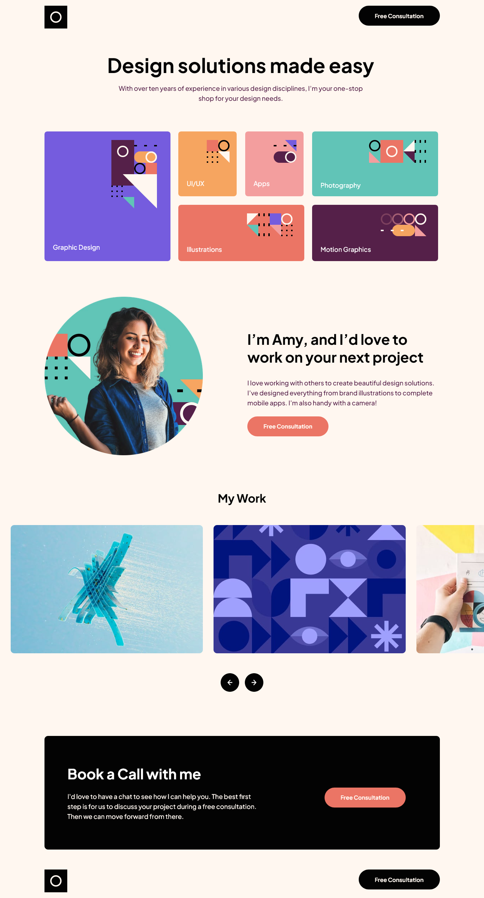

# Frontend Mentor - Single-page design portfolio solution

This is a solution to the [Single-page design portfolio challenge on Frontend Mentor](https://www.frontendmentor.io/challenges/singlepage-design-portfolio-2MMhyhfKVo). Frontend Mentor challenges help you improve your coding skills by building realistic projects.

## Table of contents

- [Overview](#overview)
  - [The challenge](#the-challenge)
  - [Screenshot](#screenshot)
  - [Links](#links)
- [My process](#my-process)
  - [Built with](#built-with)
  - [Useful resources](#useful-resources)
- [Author](#author)
- [Acknowledgments](#acknowledgments)

### The challenge

Users should be able to:

- View the optimal layout for the site depending on their device's screen size
- See hover states for all interactive elements on the page
- Navigate the slider using either their mouse/trackpad or keyboard

Users should be able to:

### Screenshot

### Links

- Solution URL: [Solution URL](https://github.com/engsofjvolfe/frontendmentor/tree/main/single-page-design-portfolio)
- Live Site URL: [Live site URL](https://jvolfe-single-design-portfolio.netlify.app/)

## My process

### Built with

- Semantic HTML5 markup
- CSS custom properties
- Flexbox
- Mobile-first workflow
- JavaScript

## Author

- Git Hub - [@engsofjvolfe](https://github.com/engsofjvolfe)
- Frontend Mentor - [@engsofjvolfe](https://www.frontendmentor.io/profile/engsofjvolfe)
- LinkedIn - [@jeanco-volfe](https://www.linkedin.com/in/jeanco-volfe/)
<!-- - Instagram - [@jeanco_volfe](https://www.instagram.com/jeanco_volfe/) -->
