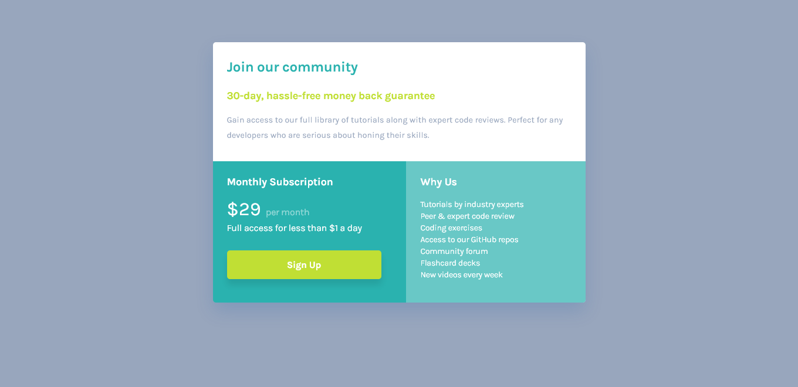

# Frontend Mentor - Ping coming soon page solution

This is a solution to the [Single Price Grid Component Master](https://www.frontendmentor.io/challenges/single-price-grid-component-5ce41129d0ff452fec5abbbc/hub). Frontend Mentor challenges help you improve your coding skills by building realistic projects.

## Table of contents

- [Overview](#overview)
  - [The challenge](#the-challenge)
  - [Screenshot](#screenshot)
  - [Links](#links)
- [My process](#my-process)
  - [Built with](#built-with)
- [Author](#author)

### The challenge

- Users should be able to:

- View the optimal layout for the component depending on their device's screen size

### Screenshot

### Links

- Solution URL: [Solution URL](https://github.com/engsofjvolfe/frontendmentor/edit/main/single-price-grid-component-master/README.md)
- Live Site URL: [Live site URL](https://jvolfe-flexbox-lpg.netlify.app/)

## My process

### Built with

- Semantic HTML5 markup
- CSS custom properties
- Mobile-first workflow

### What I learned

### Continued development

## Author

- Git Hub - [@engsofjvolfe](https://github.com/engsofjvolfe)
- Frontend Mentor - [@engsofjvolfe](https://www.frontendmentor.io/profile/engsofjvolfe)
- LinkedIn - [@jeanco-volfe](https://www.linkedin.com/in/jeanco-volfe/)
